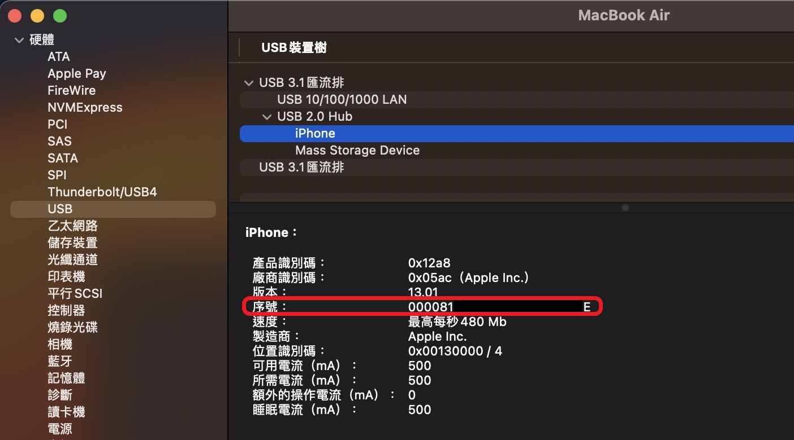
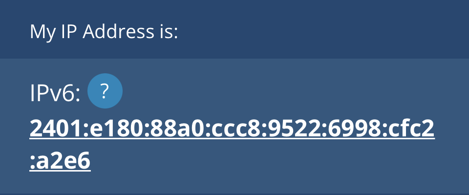
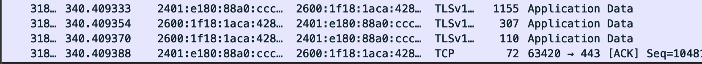

# Capture IPhone packet

**!!! This method is only usable for Mac !!!**  

## Install wireshark

1. Download wireshark from [link](https://www.wireshark.org/download.html)
2. Double click **Wireshark *.dmg** file to open the download file
3. Move **Wireshark** to **Applications**
4. Open **Read me first.html** follow the **Quick Setup** for environment setup

## Install Xcode, rvictl

1. Check your **macOS version** and find the **Xcode version** that match your device from [Apple developer SDK](https://developer.apple.com/support/xcode/?source=post_page-----cf501c97bb42--------------------------------)
2. Download the specific Xcode version from [link](https://idmsa.apple.com/IDMSWebAuth/signin.html?path=%2Fdownload%2Fall%2F%3Fq%3Dxcode&appIdKey=891bd3417a7776362562d2197f89480a8547b108fd934911bcbea0110d07f757&rv=0)
3. Install dependencies of rvictl 
    
    ```bash
    $ cd /Applications/Xcode.app/Contents/Resources/Packages
    $ installer -pkg MobileDevice.pkg -target /
    $ installer -pkg MobileDeviceDevelopment.pkg -target /
    ```
    
4. Add system path for rvictl
    
    ```bash
    $ cd
    $ vim /etc/paths
    # add rvictl path 
    /Library/Apple/usr/bin/
    ```
    

## Check IPhone UDID

1. Connect your IPhone to Mac
2. About this Mac → More information → System Report → USB
3. Click your IPhone and get the UDID (00xxxxxxxxxxxxxxxxxxxx1E)
    
    
    
4. Add dash after the 8th digit than it’s your final UDID (00xxxxxx-xxxxxxxxxxxxxx1E)

## Execute rvictl

1. Check interface
    
    ```bash
    $ ifconfig -l
    # Response
    lo0 gif0 stf0 anpi1 anpi0 anpi2 en4 en5 en6 en1 en2 en3 ap1 en0 awdl0 bridge0 utun0 utun1 utun2 en7
    ```
    
2. Create virtual interface
    
    ```bash
    # rvictl -s <your final UDID>
    $ rvictl -s 00xxxxxx-xxxxxxxxxxxxxx1E
    ```
    
    2-1. If rvictl Failed
    
    ```bash
    # Response
    bootstrap_look_up(): 1102
    Starting device 00xxxxxx-xxxxxxxxxxxxxx1E [FAILED]
    ```
    
    Solution : launch com.apple.rpmuxd by following command
    
    ```bash
    $ sudo launchctl load -w /Library/Apple/System/Library/LaunchDaemons/com.apple.rpmuxd.plist
    ```
    
    redo 2.
    
3. Check interface : Get new interface `rvi0` that create by rvictl
    
    ```bash
    $ ifconfig -l
    # Response
    lo0 gif0 stf0 anpi1 anpi0 anpi2 en4 en5 en6 en1 en2 en3 ap1 en0 awdl0 bridge0 utun0 utun1 utun2 en7 rvi0
    ```
    

## Open wireshark check the packet

